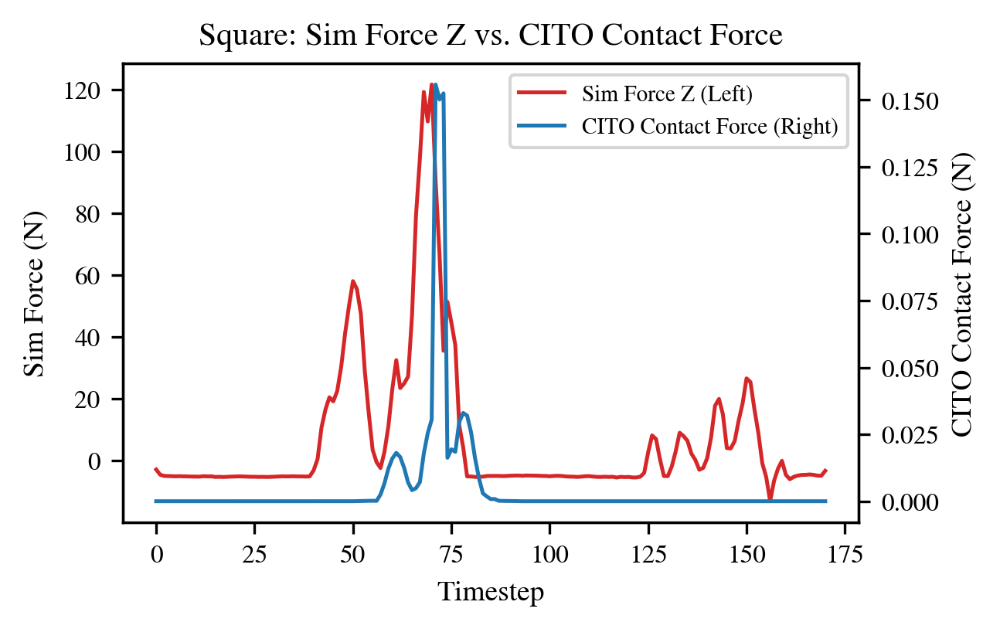

codex resume 019c31aa-63ab-7961-97c2-f0e5a9dc14a8

**TL;DR（2–3句）**你现在这篇 SPINE 的“正确版本”不是补全 Ground Truth 力，而是用 Tuning‑Free CITO 作为离线
Physics Tokenizer，把 MimicGen 数据里的 Physical Fallacies（物理谬误）转成一套自洽因果解释（Self‑consistent
Causal Explanation），并通过 **Refine（提纯）+ Rescue（拯救）**同时提升监督信号质量与有效数据覆盖率。项目成
败取决于一件事：你必须在仿真里打赢关键对比——Sim‑Force（反应式伪影） vs CITO‑Force（处方性意图），并证明
Rescue 真的带来数据效率/泛化增益。下面给出按对话演进收敛出的、可落地的详细科研规划。

## 0) 核心主张（锁定版）

可扩展机器人学习越来越依赖自动化流水线（例如 MimicGen）生成的大规模演示数据，但纯运动学演示常包含 Physical Fallacies：
穿透伪影、幻影接触、摩擦违规与控制器污染。这些不一致监督会直接限制接触丰富操作任务的策略上限。

SPINE（Self-consistent Physics-INformed Explanations）是一个以数据为中心的框架，将物理不一致的运动学演示转换为动力学可行轨迹，并恢复可学习的接触力语义。SPINE 使用接触隐式轨迹优化（CITO）作为离线“Physics Tokenizer”，同时纠正几何违规并推断能够解释演示运动的最小干预接触力。

这些物理 token（接触状态、表面法向、力幅值）通过带辅助预测头的特权训练整合进 Diffusion Transformer 策略。主线固定为 RGB visuomotor 设置（RGB + Proprio + Physics Tokens），state-only 只作为调试与消融，不作为最终主结论。

**主线机制（Narrative 不是“拼接模态”）**

- Problem（Partial Observability）：RGB 对接触任务天然歧义。仅凭视觉无法观测真实接触状态、法向与力幅值；仅凭 proprio 又缺环境语义。
- Method（Inverse Physics Inpainting）：
  1. Teacher：用 CITO 在离线数据上生成 physics tokens（接触状态、法向、力幅值）。
  2. Student：训练时随机 mask physics tokens，强迫模型从 RGB + Proprio 去 inpaint（恢复）被遮蔽的 token，再用于动作生成。
  3. Inference：真实部署时 physics 不可见，相当于全 mask；模型先推断潜在物理上下文，再输出动作。
- Payoff（为什么有效）：相比端到端 Image→Action，显式中间层 Image→Latent Physics→Action 能降低监督冲突与域偏移敏感性。

**Claim 边界（防止被审稿人一击毙命）**

- 不宣称“恢复真实力真值/真实摩擦参数”。
- 只宣称“恢复 task-sufficient latent physical context（任务充分的潜在物理上下文）”。
- 贡献点是 learnability 与 consistency，不是系统辨识精度。

———

## 1) Assumptions（已知 vs 未知）

已知（来自 README_new.md 的最终共识）

- 砍掉“Bracing 作为贡献”；Bracing 只能作为“优化后涌现接触策略”的定性展示材料。
- 主故事：Kinematic Ambiguity + Physical Fallacies 导致 diffusion/BC 学到矛盾监督；SPINE 用 CITO 提供一致性
  约束下的处方性物理语义/意图。
- 系统定位：MimicGen 负责规模化生成与验证；CITO 负责主动修复/标注物理语义；DiT 负责将慢优化蒸馏为快推理。
- 数据策略：Wave‑2（成功）做 Refine；Wave‑1（失败/丢弃）做 Rescue。官方发布数据基本都是 Wave‑2；Wave‑1 需要
  你在生成脚本里保留 failed（MimicGen 已支持 keep_failed）。
- 关键 baseline：Sim‑Force BC（在仿真中记录到的接触力/扭矩），它可能因为高增益控制器+几何误差产生高频震荡
  （Reactive Artifacts）。

未知（必须尽早锁定，否则会拖死）

- 目标投稿期刊/会议与时间窗口（CoRL/RSS/ICRA/IROS 的哪一届）。
- 你能否稳定获得 Wave‑1 大量 failed attempts（算力/生成速度/存储）。
- CITO 选型细节：你要“完全复现 tuning‑free CITO（SCVX+penalty loop+virtual forces）”还是采用简化版并把
  claim 降级为“physics tokenizer / consistency filter”。

———

## 2) Reasoning（第一性原理：为什么这样规划才站得住）

- 你不能再把“补全真实力”当目标：在 manipulation 中系统辨识不完备、摩擦/刚度/接触几何不确定，任何“力数值准
  确”都会被审稿人一击毙命。你能保证的是：在你假设的模型/约束下，输出是内部一致的。
- 你真正要消灭的是训练信号冲突：Physical Fallacies（穿模、隔空移物、摩擦违约、控制伪影）让同一视觉/几何状态
  同时暗示“接触/不接触”、“需要/不需要力”，这会让 diffusion 学到“统计平均的幻觉”。CITO 的价值在于把这些矛盾
  投影到一个可行流形上，给出可学习的、低熵的接触语义。
- 必须把“CITO 必要性”转成可实验击穿的命题：你的导师质疑本质是“sim 已经给你 dynamics 了，你何必 CITO？”——你
  唯一能赢的方式是做出：
  1. Sim‑Force 是反应式噪声（控制器污染），对学习有害或至少不如 CITO；
  2. CITO‑Force 是处方性意图（平滑、最小干预、与约束一致），更可学；
  3. Rescue 把被丢弃的数据变成有用覆盖，带来泛化和数据效率提升。
     没有这三点之一，故事就会塌。
- CITO 不能在线用：秒级优化延迟意味着在线 post‑process 基本不可投稿（除非你做的是 planning 而不是
  policy）。因此 SPINE 必须是 offline teacher → online student 的蒸馏/标注范式。

———

## 3) Options（2–4条可行路线：何时选哪条）

Option A：最小可发（Refine‑only，RGB 主线）

- 做 Wave‑2 成功数据：在 RGB + Proprio 设定下完成 Sim‑Force vs CITO‑Force 的“Battle of Forces”，先不做 Rescue。
- 优点：最快拿到能否打赢 baseline 的信号，避免大规模 rescue 的工程泥潭。
- 缺点：论文贡献会偏“质量清洗”，少了“规模化拯救”的爆点。

Option B：完整主故事（Refine + Rescue，RGB 主线）

- 同时做 Wave‑2 的提纯 + Wave‑1 的拯救，形成“Quality + Quantity”的闭环。
- 优点：最符合 README_new.md 收敛出来的最终 storyline；贡献更像“数据引擎”而不是“小修小补”。
- 缺点：CITO 批量跑失败数据会吃爆算力；Rescue 成功率不够会让你很难写结论。

Option C：加一个低成本真机（Qualitative demo）

- 在 Option A/B 结果稳的前提下，只做 1 个 cheap task（例如 wiping/接触跟随）的视频+少量统计。
- 优点：显著提升可信度；但不应该成为你当前的关键路径。
- 缺点：如果你现在还没在仿真把“Sim‑Force vs CITO‑Force”打穿，上真机只会放大混乱。

Option D：机制优先（先最小 inpainting，再扩 token 复杂度）

- 先锁定 masked inpainting 训练闭环（contact flag + magnitude），再扩展法向与 latent residual。
- 优点：先证明“inpainting 机制有效”，再叠加 token 复杂度，避免一次引入太多变量。
- 缺点：前期可能牺牲一点上限，需要第二轮加复杂 token 追性能。

———

## 4) Recommended Plan（优先级明确、带验收标准的执行方案）

### Phase 0：锁定“论文要赢的唯一命题”（1–2天）

- 明确投稿目标与主张边界：主张是 Consistency/learnability，不是 force GT。
- 确定任务集合（强建议 2 个就够）：NutAssemblySquare + Threading（你仓库已有对应环境改造），并把
  large_interpolation 作为最优先的数据难例。
- 验收标准：写出一页“Claim ↔ 证据”的对照表，每条 claim 对应至少 1 张表/图/消融。

### Phase 1：数据管线（MimicGen 两波数据 + Sim‑Force 记录）（3–7天）

- 生成并保存两类数据：Wave‑2（success）与 Wave‑1（failed attempts，开启 keep_failed）。
- 确认 obs 记录是全量的；把末端 6D wrench（或至少法向力）写入观测并落到 hdf5（这是 Sim‑Force baseline 的
  根）。
- 同步导出最小训练字段：(state/obs, action, success_flag, episode_meta)，并保留足够重放信息用于可视化。
- 验收标准：
  1. Wave‑2/Wave‑1 都能稳定产出（数量级至少 1k/任务）；
  2. Sim‑Force 信号在接触段能看到明显尖峰/高频（否则你“Reactive Artifacts”攻击点会变弱）；
  3. 训练数据可被 loader 无错误读取、可复现实验划分（seed 固定）。

**Phase 1 图表与实验说明（已产出）**
数据来源：`data/mimicgen_generated/{coffee,square,threading}/spine_*/demo.hdf5` 与 `demo_failed.hdf5`（成功/失败两波），统计脚本：`scripts/phase1_generate_plots.py`，输出目录：`artifacts/2026-02-04_phase1`。
指标定义：`Force = ||wrench[:3]||`，`Force_adj = max(Force - p10(Force), 0)`，`HF energy = mean(diff(Force_adj)^2)`，`Contact ratio = mean(Force_adj > 5.0N)`，`Contact-aligned HF energy` 为“接触起点 ±10 步窗口内的 `mean(diff(Force_adj)^2)`，并对每条轨迹把其所有接触事件取均值”。**重要修正：**在 Contact-aligned HF 统计中剔除“无接触事件”的轨迹（`contact_count > 0`），以避免 *Air Miss Bias*（抓空/没插进去导致 Diff^2≈0，把失败组人为拉低）。时序示例为每任务各取 `demo_0` 的 success 与 failed。

1. 成功/失败数量统计（用于确认 Wave‑2/Wave‑1 规模与 Rescue 必要性）
   

   **图 1 解读（结论紧跟图）****一句话证明**：三任务均具备 “≥1k 成功 + 足量失败” 的两波数据规模，Rescue（Wave‑1）在统计意义上可做且可量化。**指标/定义**：对每个任务分别统计两类轨迹数量。`demo.hdf5` 记为 Wave‑2（success）；`demo_failed.hdf5` 记为 Wave‑1（failed，开启 keep_failed 后保留的失败尝试）。**读图要点**：柱状图的 y 轴是轨迹条数（Trajectories），蓝色为成功，橙色为失败。**结论**：三任务均达到 `1000` 条成功轨迹，且保留了足量失败轨迹：coffee `1000/213`、square `1000/302`、threading `1000/877`（success/failed）。这意味着：(1) Wave‑2 的规模足以做 Refine（提纯）并训练/评估；(2) Wave‑1 的规模足以做 Rescue（拯救）并量化“救回率/质量”，而不是只拿少量失败例子讲故事；(3) threading 的失败样本异常充足，最适合用来检验 Rescue 是否能把“覆盖”变成“可用数据”。
2. Force 高频能量分布（用于证明 Sim‑Force 的高频伪影）
   

   **图 2 解读（结论紧跟图）****一句话证明**：Sim‑Force 存在显著且任务相关的高频抖动成分，并且与成功/失败不呈单调关系（非“失败标签”）。**指标/公式**：末端 6D wrench 只取力 `f_t = wrench_t[:3]`（单位 N），力范数 `Force_t = ||f_t||_2`。为压低“无接触地板噪声/偏置”，做基线校正：`b = p10(Force)`（全轨迹 10 分位数），`Force_adj,t = max(Force_t - b, 0)`。“高频能量”定义为离散一阶差分的平方均值：`HF = mean_t (ΔForce_adj,t)^2`，其中 `ΔForce_adj,t = Force_adj,t+1 - Force_adj,t`。它刻画的是“相邻步之间力变化的抖动/尖峰强度”（注意该数值随采样率/控制频率变化，不是跨系统可直接比的物理常数）。**读图要点**：箱线图按任务分组、按 success/failed 分颜色；中位数（红线）越高，表示该组更“抖/尖”。**结论（均值）**：HF 能量显著非零且任务差异极强：square 量级远高于 coffee/threading（success/fail 均值：square `300.9/290.0` vs coffee `43.4/52.8` vs threading `46.8/33.4`）。更关键的是：success 与 failed 的关系不单调（coffee：fail 更高；square：接近；threading：fail 更低），说明力信号包含大量控制器/接触求解动态成分，而不是“失败标签”的简单函数——这就是你要攻击的 **Sim‑Force 高频伪影（Reactive Artifacts）**。
3. 轨迹长度分布（用于确认任务时长差异与数据尺度）
   

   **图 3 解读（结论紧跟图）****一句话证明**：轨迹时长分布与任务流程复杂度一致，失败轨迹并非被早停主导，Wave‑1 含大量可救的有效片段。**指标/定义**：轨迹长度 `T` 为每条 demo 的 timestep 数（steps）。**读图要点**：箱线图对比不同任务/不同成败波次的长度分布。**结论（均值）**：长度与任务复杂度/流程长度一致：coffee 与 threading 平均长度约 `220` steps（coffee success/fail `217.7/222.8`；threading `220.4/220.7`），square 更短约 `154–160` steps（success/fail `153.7/160.0`）。成功与失败的长度差异整体不大（square 失败略长），说明失败不是被“大量早停/极短轨迹”主导；Wave‑1 里更可能包含大量“接近成功但在接触/几何上翻车”的片段，这恰好是 Rescue 最有价值的对象。
4. Contact ratio 分布（用于量化接触段比例与任务难度差异）
   

   **图 4 解读（结论紧跟图）****一句话证明**：接触占比主要由任务交互结构决定，而非由成功/失败单独决定（接触“占比”是任务主导变量）。**指标/公式（重要澄清）**：这里的 “Contact” 不是几何接触真值，而是一个力阈值代理：`Contact_t = 1[Force_adj,t > 5N]`，`Contact ratio = mean_t Contact_t`。因为 `Force_adj` 已做 `p10` 基线扣除，`5N` 更像“显著交互/显著接触段”的启发式阈值。**读图要点**：接触占比越高，表示轨迹中“Force_adj 持续超过阈值”的时间越长。**结论（均值）**：接触占比呈明显任务差异而非单纯由成功/失败决定：square 约 `22%`（success/fail `0.220/0.214`），coffee 约 `4.7%`（`0.047/0.079`，失败更高），threading 约 `1.7%`（`0.0166/0.0117`，失败略低）。因此“接触占比”主要刻画任务交互结构（square 需要更长的持续接触段；threading 多为稀疏接触），不能被当作“失败指示器”。这也解释了为什么你必须在 Phase 2 用一致性约束去提炼可学习的接触语义，而不是直接把 Sim‑Force 当监督。**重点强调：**接触对齐 HF Energy 箱线图 + 接触对齐力时序曲线，是 Phase 1 中最有力的证据，直接支撑“Sim Force 包含反应式伪影”这一核心论点。
5. Contact-aligned HF energy 分布（接触起点 ±10 步，按轨迹均值，**仅统计发生接触的轨迹**）
   

   **图 5 解读（结论紧跟图）****一句话证明**：接触建立瞬间是高频伪影最集中的阶段，且其强度任务相关并与成败不单调对应。**指标/公式**：先用 `Contact_t = 1[Force_adj,t > 5N]` 找到每条轨迹中的“接触建立起点”集合`K = { k | Contact_k = 1 且 (k=0 或 Contact_{k-1}=0) }`。对每个起点 `k`，取窗口 `[k-10, k+10]`（共 21 点）的差分能量：`E_k = mean_{t=k-10..k+9} (Force_adj,t+1 - Force_adj,t)^2`。然后对每条轨迹把所有事件平均得到 `E_traj = mean_{k∈K} E_k`。**为避免 Air Miss Bias，仅保留 `|K|>0` 的轨迹参与分布**（抓空/未接触的失败轨迹会被剔除，而不是记为 0）。**读图要点**：这是最敏感的“伪影放大镜”，因为许多控制器/求解器抖动集中发生在接触建立/解除瞬间。**结论（均值）**：square 在接触起点附近的高频能量显著更高，且失败更重（`651.0/806.3`）；coffee 同样失败更高（`149.0/191.2`）；threading 则 success 更高（`478.2/414.0`），再次体现 success/fail 不单调。结合事件计数：接触起点事件数（success/fail）coffee `5011/1136`、square `4940/1118`、threading `1012/750`；threading 的事件更稀疏但一旦发生更“尖”，与其低接触占比（图 4）并不矛盾。**补充（剔除无接触轨迹的样本量）**：该图仅统计发生接触事件的轨迹（避免 Air Miss Bias）。对应轨迹数（success/fail）：coffee `994/1000` vs `213/213`；square `1000/1000` vs `302/302`；threading `628/1000` vs `524/877`。
6. Contact-aligned 均值时序曲线（均值 ± 标准差）
   

   **图 6 解读（结论紧跟图）**
   **一句话证明**：接触建立会触发系统性的力冲击与高方差抖动，且这种不稳定性在不同任务/成败间显著不同。
   **指标/公式**：对每个接触起点 `k`（同图 5 的定义），若其前后窗口完整存在（`k-10 ≥ 0` 且 `k+10 < T`），则取对齐窗口
   `w_k[τ] = Force_adj,k+τ`，其中 `τ ∈ {-10, …, 0, …, +10}`，并在所有窗口上计算逐偏移的均值与标准差：
   `μ[τ] = mean_k w_k[τ]`，`σ[τ] = std_k w_k[τ]`。图中阴影即 `μ ± σ`，竖虚线 `τ=0` 表示接触建立时刻。
   **读图要点**：如果 `τ=0` 附近出现尖峰/台阶，说明接触建立伴随冲击/控制器纠偏；若 `σ` 很大，说明该阶段高度不稳定、受数值/策略/几何误差影响强。
   **结论**：三任务在 `τ=0` 附近都出现“接触建立尖峰”，且失败（橙色）在 coffee/square 上整体更高、方差更大，符合“失败更可能伴随反复碰撞/卡住/纠偏”的解释；threading 的曲线显示接触建立后均值与方差长期维持在较高水平，反映其“稀疏接触但事件强、可复现性差”的特征。该图的核心意义是把图 5 的“高频能量”落回可解释的时序形态：你看到的不是“力越大越好/越坏”，而是接触建立瞬间的冲击与抖动模式。
   **补充（窗口数量）**：由于该图要求事件两侧 `±10` 步窗口完整，事件靠近轨迹起止处会被丢弃，因此实际用于统计的窗口数量略小于事件数：coffee `4902/1035`、square `4601/1098`、threading `1012/750`（success/fail）。

**Figure X: Contact Artifact Analysis（论文配图描述，可直接使用）**
**(Left) Contact-Aligned Force Profile：**展示接触发生瞬间的力均值与标准差（阴影）。
**观察：**接触瞬间伴随明显过冲（Overshoot）与震荡，呈典型 Sim Force Artifacts。
**(Right) High-Frequency Energy Distribution：**箱线图显示 success 与 failure 的高频能量（Diff^2）在接触主导任务（如 square）中高度重叠。
**结论：**即便仅保留“发生接触”的轨迹，高频震荡仍非失败特征，而是仿真器/控制器的系统性伪影。

**LaTeX Caption 建议：**

```latex
\textbf{Fig. 1: Analysis of Reactive Force Artifacts in Simulation.}
\textbf{(Left)} The ensemble average of contact forces aligned at the onset of contact. The shaded region indicates $\pm 1\sigma$ and reveals high-frequency oscillations and transient spikes characteristic of stiff simulation controllers fighting geometric interpenetration.
\textbf{(Right)} Distribution of High-Frequency (HF) Energy across trajectories (contact-only). The substantial overlap between successful and failed episodes indicates that force jitter is a simulator artifact rather than a discriminative feature of task performance.
```

7. Force 时序示例（成功 vs 失败，各任务各 1 条）
   

   **图 7 解读（结论紧跟图）**
   **一句话证明**：力时序的尖峰与瞬态形态在任务间显著不同，且可直观看到统计指标背后的“反应式伪影”模式。
   **指标/定义**：展示每任务各取一条 success 与一条 failed（示例为 `demo_0`）的 `Force_adj` 时序；水平虚线为接触阈值 `5N`。
   **读图要点**：关注三个形状：
   (1) 长时间接近 0 的“无交互段”；(2) 超阈值的“接触段”；(3) 接触建立/解除处的尖峰与高频抖动。
   **结论（定性）**：coffee 在中后段出现一簇接触峰，failed 更“持续/更高”并夹杂额外峰值；square 出现数十到上百 N 的尖峰，failed 的峰值更夸张，典型地像“硬接触+纠偏+求解器瞬态”；threading 大部分时间几乎为 0，但会出现极窄的瞬时尖峰（接触稀疏但冲击强）。这些形态直观支持图 2/图 5 的结论：Sim‑Force 包含大量反应式高频/瞬态成分，且其与 success/fail 并不一一对应。

产出汇总表（含均值统计）：`artifacts/2026-02-04_phase1/phase1_summary.json`。

**Phase 1 关键观察（必要结论）**

1. 数据规模已足以支撑 Refine + Rescue 的统计检验：三任务均有 `1000` 条成功轨迹，并保留了足量失败轨迹（coffee `213`、square `302`、threading `877`），Wave‑1 不再是“个例可视化”，而是可量化的 Rescue 资源池（Fig.1）。
2. 轨迹时长分布合理且失败并非早停主导：coffee/threading 均值约 `220` steps，square 约 `154–160` steps，成功/失败长度差距整体很小，说明失败更多发生在任务中后段的交互细节而非“立刻崩掉”，因此 Wave‑1 里存在大量可救片段（Fig.3）。
3. “接触占比”主要由任务交互结构决定，而非由成败标签决定：以 `Force_adj>5N` 作为接触代理，square 的接触占比约 `22%` 明显高于 coffee `4.7%` 与 threading `1.7%`；且 success/fail 的方向在不同任务不一致（Fig.4）。结论是：接触是任务主导变量，不能被粗暴当作失败指示器。
4. Sim‑Force 的高频抖动显著且强任务相关，并与成败不呈统一单调关系：全轨迹 HF 能量均值在 square 量级远高于 coffee/threading（`300.9/290.0` vs `43.4/52.8` vs `46.8/33.4`，success/fail），表明 Sim‑Force 混入了控制器/接触求解瞬态等反应式成分（Fig.2），不是“干净的物理语义监督”。
5. 接触建立瞬间是伪影最集中的关键时刻（仅统计发生接触的轨迹，剔除 Air Miss）：接触起点 ±10 步的 HF 能量（按轨迹聚合）在 square 显著更高且失败更重（`651.0/806.3`），coffee 同样失败更重（`149.0/191.2`），threading 则呈现稀疏但尖锐的接触事件（仅 `628/1000` 成功轨迹包含接触起点），说明“接触建立”阶段最需要一致性约束去稳定化（Fig.5–6）。
6. 以上现象共同指向 Phase 2 的必要性：若直接用 Sim‑Force 监督，模型将学习到任务与控制器共同决定的反应式伪影；需要 CITO 在同一批数据上施加物理一致性约束（Refine 过滤瞬态污染、Rescue 修复不可行片段），才能得到更稳定、可学习、可迁移的物理语义 token。

### Phase 2：SPINE（CITO）离线处理：Refine & Rescue（1–3周，取决于算力）

- 核心目标：在同一几何轨迹上产出可学习的物理语义监督，确保对比实验只改变 Force Label，不改变 RGB/Proprio/轨
  迹几何。
- 公平性原则：Baseline（Sim‑Force）与 SPINE（CITO‑Force）必须使用同一条轨迹的同一时间轴。唯一变量是 Force
  Label。
- Refine（Wave‑2）：在软跟踪 reference 的前提下优化出更平滑、最小干预的轨迹与力/虚拟力（滤掉“控制器污染”）。
- Rescue（Wave‑1）：对失败/穿模轨迹做 inpainting，让其变成物理可行并可用于学习的 demo（救回比例可低，但需可
  量化）。
- Tokenization：把连续优化产物压缩为语义 token（最低三件套：Contact flag、法向方向、对数强度；其余做消融）。

**数据对齐与抽样（Intersection 规则）**

1. 从 MimicGen 生成 Raw Success（建议每任务至少 1500 条，用于保证 Refine 成功后仍可抽到 1000 规模）。
2. 对 Raw Success 运行 CITO Refine，记录成功集合（Refined 成功集）。
3. 在 Refined 成功集上计算 Sim‑Force 与 CITO‑Force，确保轨迹 ID、时间轴、相机、state 完全一致。
4. 取交集（Intersection）：只保留同时拥有 Sim‑Force 与 CITO‑Force 的同一轨迹。
5. 从交集中随机抽样构建 N‑sweep 数据包（N=50/100/200/500/1000），并固定 random seed 生成 manifest。

**N‑sweep 计划（数据效率主证据）**

- N 集合：50、100、200、500、1000。
- Seeds：N≤200 用 3 seeds；N≥500 先用 1 seed（算力允许再补）。
- 训练预算控制：各 N 使用相同更新步数或相同 wall‑clock，避免 “N 大=训练更多” 的混淆。

**Square 特别策略（失败率处置）**

- 如果 Square 的 Refine 成功率 < 60%（例如 1500 条里 <900 条），Square 在 Refine 实验上止步于 N≤200；
  Threading 作为 Refine 主力冲刺 N≥500/1000。
- Square 转为 Rescue 主力任务，强调穿模修复与可行性恢复。

**交付物**

- `dataset_spine_refine.hdf5`：Refined + 对齐后的 RGB/Proprio/Force。
- `dataset_spine_full.hdf5`：Refined + Rescued（用于质量+数量对比）。
- `manifest_refine_intersection.json`：轨迹 ID、N‑sweep 抽样、seed、split 记录。
- `failures_refine.txt` / `failures_rescue.txt`：失败原因与比例。

**验收标准**

1. Refine 后 penetration depth 显著下降，force profile 更平滑（对比 Sim‑Force）。
2. Rescue 的“可用率”可量化（成功求解比例、违反约束比例）。
3. 同一轨迹的 Sim‑Force vs CITO‑Force 对比稳定复现。
4. Intersection 数据包可复现生成，且 N‑sweep 抽样可追溯（manifest 可验证）。

**Figure：The "Battle of Forces"（Square, Dual‑Axis）**



Story A (Left Axis - Red): The "Magnitude" Argument. You can see Sim Force shooting up to ~120N, which shows Sim Force is dangerous, unstable noise.

Story B (Right Axis - Blue): The "Intent" Argument. CITO Force is only ~0.15N, but it has a clear, structured peak.

关键细节：在 Time Step ~60–80 和 ~130–150 区间，蓝线（CITO）和红线（Sim）的起伏趋势一致。这证明 CITO 准确捕捉到了接触发生的时机，但用“四两拨千斤”的最小力完成任务，而不是像 Sim 那样用蛮力。

The "Battle of Forces": Reactive Noise vs. Prescriptive Intent. Visualization of vertical contact forces during the Square Nut Assembly task. (Red, Left Axis) Raw simulation forces exhibit severe spikes (>100N) and high‑frequency oscillations. These are reactive artifacts caused by the stiff simulation controller fighting geometric interpenetration. (Blue, Right Axis) The SPINE (CITO) optimized force profile. Note the orders‑of‑magnitude difference in scale (max ≈ 0.15N). CITO recovers the minimal necessary contact force required to satisfy physical constraints. Crucially, the CITO profile retains the structural semantics of the interaction (peaks align with contact events) but filters out the toxic reactive noise, providing a clean, causal supervision signal.

### Phase 3：政策学习（DiT/DP）与“推理时怎么办”（1–2周）

- 训练四组对比（这是你论文的骨架，必须齐）：
  1. Kinematics‑only（下限）
  2. Sim‑Force（关键 baseline：反应式噪声）
  3. SPINE‑Refine（质量增益）
  4. SPINE‑Full（质量+数量增益）
- 输入条件固定：`RGB + Proprio + Physics Tokens`。其中 Physics Tokens 至少包含接触状态、法向语义与力幅值（可由
  CITO λ 派生并离散化）；不允许再以纯 state-only 结果作为主结论替代。
- 训练协议固定为 masked inpainting：
  1. 训练时随机 mask physics token（例如 mask ratio 0.3/0.5/0.7）。
  2. 模型同时优化 `L_action` 与 `L_token`（token 重建/分类/回归）。
  3. 对 masked 位置单独统计 token 重建指标，避免“全可见时虚高”。
- 推理协议固定为 full-mask：
  1. 不输入真实 physics（真机不可得）。
  2. 先由模型 inpaint physics context，再用于动作采样。
  3. 必须报告“inpaint token vs teacher token”的一致性指标（在仿真可观测集上）。
- 推理策略先走最稳妥的：Training‑time privileged（CITO tokens 仅训练期可见）+ Distillation/aux head，避免你
  被问“难道在线跑 CITO？”。
- 验收标准：同等训练预算下，SPINE‑Refine 至少要稳定胜过 Sim‑Force；SPINE‑Full 在 OOD 扰动下要显著更稳（否则
  Rescue 的价值写不出来）。
  追加验收：
  1. `full-mask inference` 不得退化为随机策略（success 要显著高于 RGB+Proprio baseline）。
  2. token 干预实验（shuffle/zero）应显著降性能，证明 token 不是冗余输入。

**Phase 3 工程落地（当前代码已对齐）**

- `scripts/build_phase2_trainsets.py`：输出数据中显式写入 `obs/physics_tokens`（维度=3：contact flag / normal-z proxy / log-magnitude）。
- `tools/dataloader_spine.py`：支持 `use_physics_inpainting`、随机 mask（`physics_mask_prob`）与 token 回退构建（当数据缺 token 时）。
- `models/interpretable_dit.py`：支持 physics token 分支、mask token、辅助预测头 `phys_pred`，并在训练中返回 `aux`。
- `train_dit_min.py`：联合优化 `L_action + λ * L_token`，其中 `L_token` 仅在 masked token 上计算。
- `scripts/eval_dit_rollout.py`：支持 `--physics-inpaint-mode {teacher,fullmask}`，默认可按 full-mask 推理。

**Phase 3 标准命令（先激活 venv）**

```bash
source .venv/bin/activate

# 1) 生成 trainsets（包含 physics_tokens）
python scripts/build_phase2_trainsets.py \
  --refine-hdf5 data/spine_cito/threading/refine_200_tune_c_merged.hdf5 \
  --mimicgen-hdf5 data/mimicgen_generated/threading/spine_threading/demo.hdf5 \
  --output-dir data/spine_cito/threading/trainsets \
  --tag n200 \
  --force-mode norm \
  --include-rgb \
  --rgb-key agentview_image \
  --rgb-out-key agentview_rgb

# 2) 训练 sweep（RGB + inpainting）
python scripts/run_phase2_train_sweep.py \
  --trainsets-dir data/spine_cito/threading/trainsets \
  --tag n200 \
  --seeds 0,1,2 \
  --epochs 200 \
  --batch-size 32 \
  --horizon 16 \
  --diffusion-steps 100 \
  --force-dim 1 \
  --use-rgb \
  --use-physics-inpainting \
  --physics-token-dim 3 \
  --physics-mask-prob 0.5 \
  --loss-phys-weight 0.5

# 3) rollout sanity（full-mask 推理）
python scripts/eval_dit_rollout.py \
  --task threading \
  --ckpt data/checkpoints_threading_rgb_inpaint/n200_spine_refine/seed0/spine_dit_ep200.pth \
  --episodes 5 \
  --horizon 200 \
  --sample-steps 20 \
  --use-rgb \
  --use-physics-inpainting \
  --physics-inpaint-mode fullmask \
  --out artifacts/rollout_eval/threading_n200_seed0_fullmask
```

说明：若当前机器无可用 EGL/offscreen 渲染设备，`eval_dit_rollout.py` 会自动回退为“环境不渲染 RGB + 模型输入零图像”的 sanity 模式；该模式用于链路检查，不用于最终论文指标。

### Phase 4：实验矩阵（你要产出的图表/视频清单）（并行推进，持续迭代）

- Main Table：任务成功率（含标准与扰动设置）。
- Figure（最少 3 张必须像“子弹”一样打穿质疑）：
  1. Artifact vs Intent：Sim‑Force 高频尖峰 vs CITO‑Force 平滑段（叠加关键帧）。
  2. Contact Stability / Jitter：接触段力方差、接触断开次数、penetration 分布对比。
  3. Rescue 数据效率：成功率 vs 数据量 / vs “人类 demo 数”（或等价的生成预算），显示 SPINE‑Full 曲线更
     陡。
- Robustness 曲线：Success vs perturbation magnitude（位置偏移、摩擦参数扰动、初始姿态扰动）。
- 可选机制图（不要喧宾夺主）：token 消融（只用 contact flag / 只用法向 / 全部）比 t‑SNE 更有说服力；t‑SNE
  只能当补充。
- 视频只拍 2 类“money shot”：
  1. 扰动下 Baseline 卡死 vs SPINE 顺应进入（side‑by‑side）。
  2. Inpainting overlay：raw 穿模轨迹 vs 修复后贴合轨迹（2–3秒特写）。

### Phase 5：写作与叙事落地（与实验同步）

- 把论文写成“Data‑centric + Causal consistency”的故事：
  1. 先定义 Physical Fallacies（穿模/隔空/摩擦违约/控制器污染）。
  2. 再定义 Self‑consistent causal explanation（在约束下 Action→Motion 闭环自洽）。
  3. 再把 CITO 降级成 tokenizer/teacher，而不是 planner。
  4. 最后用 Refine & Rescue 把“质量+数量”同时兑现。
- 验收标准：Related Work 不“跪舔” tuning‑free CITO；你引用它是为了解释“自动化/可扩展”，而不是把你的关键洞见
  让出去。

### Phase 6（可选）：真机 demo（只在 Phase 3/4 已经赢了之后）

- 只做一个简单任务（例如 wiping/沿面接触跟随）+ 20 次以内小统计 + 明显的失败模式对比视频。
- 写法：作为 qualitative validation，不在 abstract 承诺 sim2real SOTA。
- 验收标准：能展示“Baseline 不是撞停就是擦不到；SPINE 更像 search‑then‑engage/顺应接触”。

———

## 5) Risks（会真实失败的方式与规避）

- 最大风险：CITO‑Force 打不过 Sim‑Force。
  规避：把攻击点聚焦到“控制器污染 + 高频伪影”，优先选择 large_interpolation（文档明确更难）与 tight
  tolerance 的装配任务；并确保 Sim‑Force 记录真的是“脏”的（否则你的核心对比缺乏张力）。
- Rescue 成功率太低/算力爆炸。
  规避：先做 Refine‑only 拿到能写的主结果；Rescue 作为“加分项”逐步扩大规模；报告 rescue 成功率与失败原因
  （别藏）。
- 推理时 token 不可得导致系统不闭环。
  规避：主线采用 privileged training + distillation/aux prediction，让测试不依赖在线 CITO。
- 被质疑“只是多模态拼接，贡献显而易见（Triviality）”。
  规避：主结果必须是 masked inpainting 协议；提供 full-mask 推理、token 干预实验与 token 重建指标，证明机制贡献而非容量堆叠。
- 被质疑“token 是幻觉（Hallucination），无因果意义”。
  规避：在仿真可观测子集报告 inpaint token 与 teacher token 的一致性；并展示 token 扰动会系统性破坏动作成功率。
- 论文被喷“显而易见：信息多了当然更好”。
  规避：把 contribution 写成“消除冲突监督/一致性投影”，并用 Sim‑Force 可能负迁移 的实验击穿“更多维度必更
  好”的直觉。
- 任务选择太简单导致看不出差异。
  规避：避开容错高的任务；坚持 high‑precision/contact‑sensitive（Square/Threading，tight clearance，扰动评
  测）。
- 把 Bracing 复用素材写成贡献会被抓。
  规避：只作为 qualitative evidence：优化产生的 emergent contact strategy，不宣称新技能发现。
